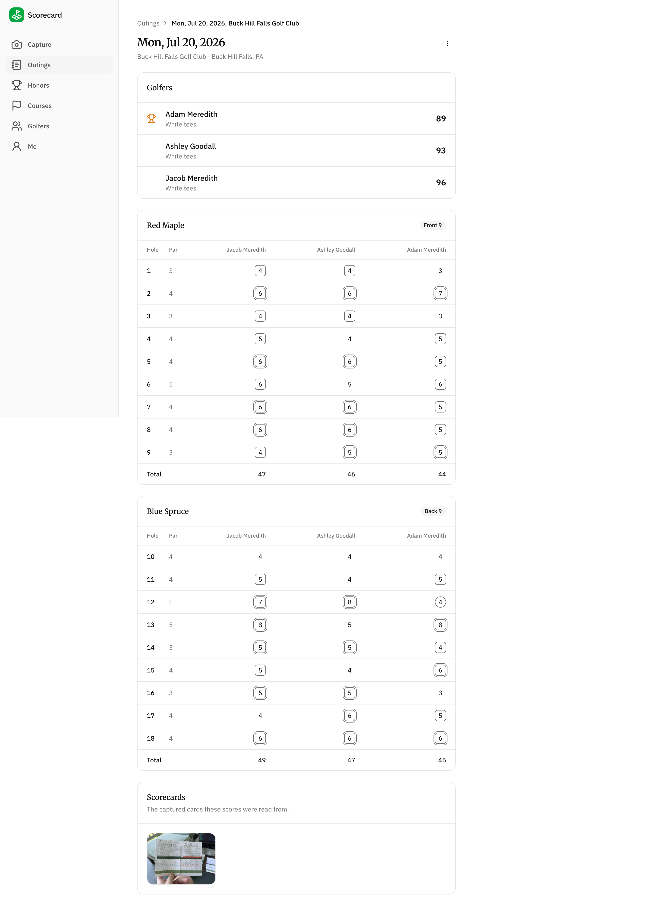
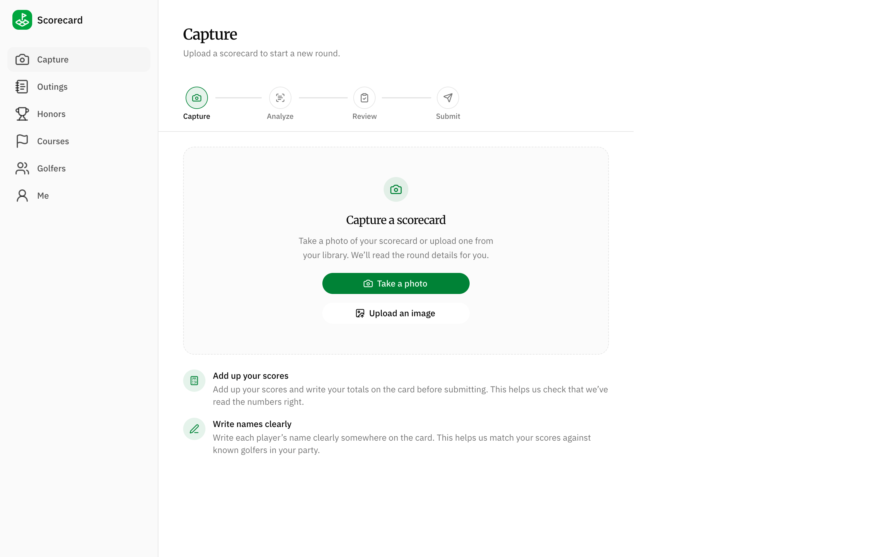
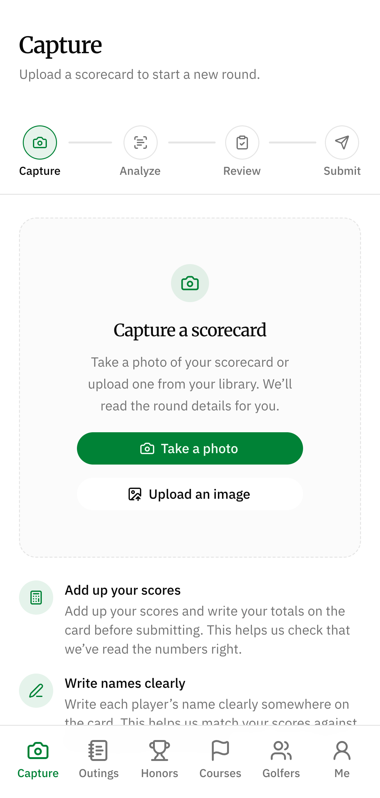
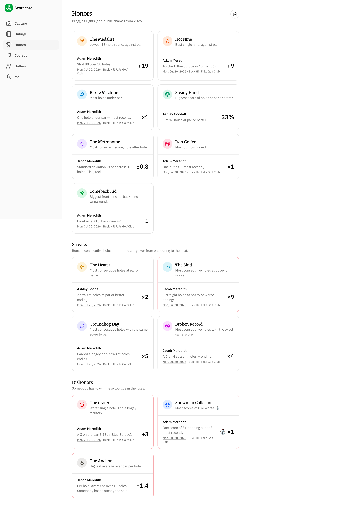
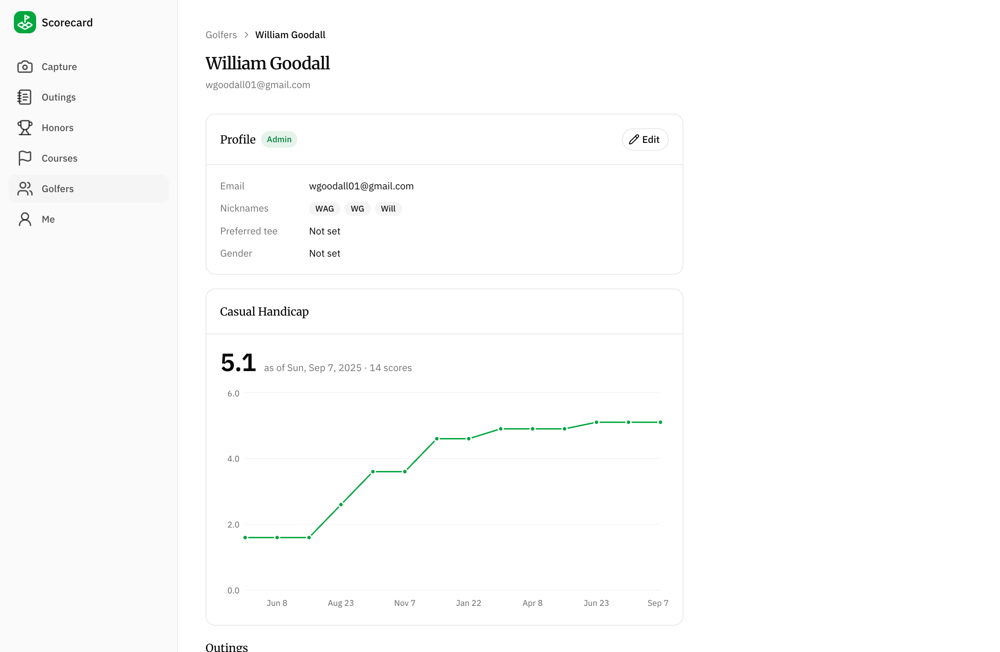
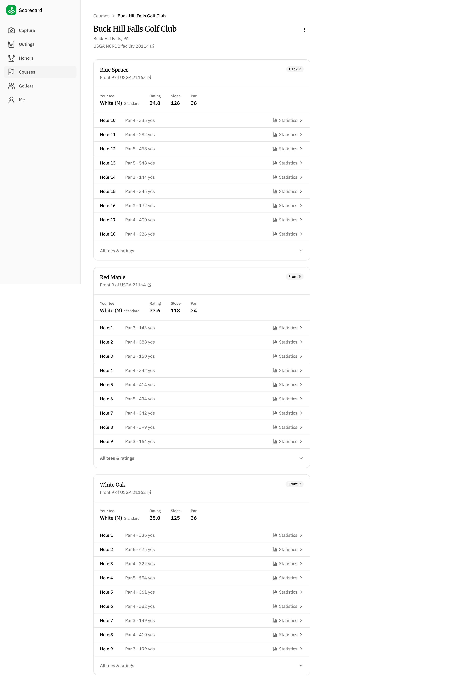
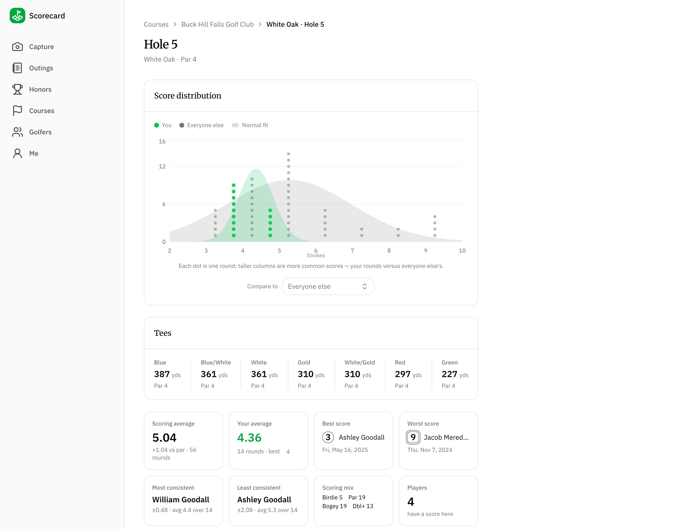
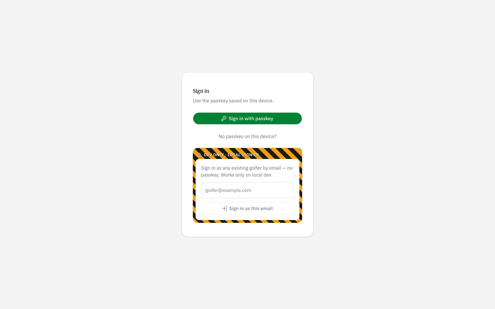
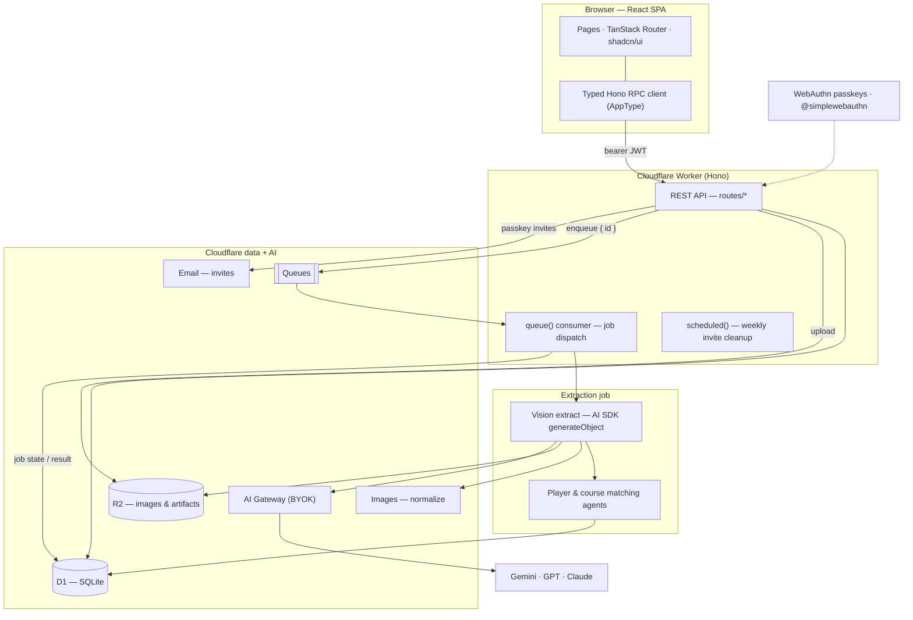

# Scorecard

Scorecard turns a **photo of a paper golf scorecard** into structured, browsable
league data. You snap a picture of the card at the end of a round; a vision model
reads the handwritten scores and player names; the app matches those against known
golfers and courses, lets you review and correct the extraction on your phone, and
records the round. From there it computes leaderboards, a WHS-style handicap
estimate, per-hole scoring distributions, and a board of tongue-in-cheek "honors"
for the group.

It's a real app my golf group uses — but it was really built as a **learning
project over a week of PTO** to get hands-on with a stack I don't normally touch:
the whole **Cloudflare developer platform** (Workers, D1, R2, Queues, Images, AI
Gateway, Email), **AI-SDK-driven vision + tool-using agents**, **WebAuthn
passkeys**, and a modern React front end on **TanStack Router** and **shadcn/ui**.
The goal was to build something end-to-end and non-trivial on tech that was new to
me, so the interesting parts of this repo are as much _how_ it's put together as
_what_ it does.

  

## Features

The app is a mobile-first SPA with six tabs (a sidebar on desktop, a bottom tab
bar on phones). Here's the tour, roughly in the order you'd use it.

### Capture → Review → Submit

The core loop. On **Capture** you take a photo (or upload one); the image goes to
R2 and an extraction job runs in the background while you move on to review.

  
  &nbsp;
  

**Review** is a two-step, phone-friendly editor over the model's extraction.
First you confirm the _date_ (defaulting to the handwritten date, with a
future-date guard), pick the _course_, and match each written name to a known
golfer — the UI shows a cropped thumbnail of the actual handwriting plus the
model's alternate readings. Then, per nine, you confirm which course nine it is,
pick each player's _tee_, and fix any misread scores in cells rendered in
**standard golf notation** (circles for birdies, squares for bogeys, judged
against each player's par). Before you submit, every handwritten total is
reconciled against the summed scores — matches auto-confirm, mismatches force an
explicit ruling. If another card from the same day already exists, it offers to
**merge** into that outing instead of creating a duplicate.

### Outings

A reverse-chronological list of every recorded round (filterable by course, nine,
and golfer), loaded a page at a time with a "Load more" footer — every list in the
app is cursor-paginated. The **detail page** (shown at the top of this README) is a
leaderboard sorted by strokes with a trophy on the winning complete round, per-nine
score tables in golf notation, and thumbnails of the scorecards the scores were
read from. Same-day/same-course outings can be merged after the fact.

### Honors

A board of named achievements over a selectable date range (defaulting to the
current calendar year, via a date-range picker in the header), in three sections:
_laurels_ like _Medalist_, _Hot Nine_, and _The Metronome_; _streaks_ like _The
Heater_ and _Groundhog Day_ (runs of consecutive holes that carry across outings,
computed gaps-and-islands style); and "_Dishonors_" like _The Crater_ and _Snowman
Collector_. Each card names the current holder, a headline stat, and a one-line
story linking back to the outing that earned it. The whole board is computed in a
**single SQLite query** (CTEs + window functions) on every request.

  

### Golfers & Handicap

A searchable roster of players. Each golfer's page shows a **"Casual Handicap"** — a
WHS-style (2024 Rules of Handicapping) index computed purely from posted rounds,
charted over time, with the per-round history below (starred where the round counts
toward the current index). There's no manually-entered handicap anywhere; it's
always derived from the scores on file.

  

### Courses & Hole stats

Courses are a read-only registry (course data is imported into the database, not
authored in the app). A course page lists each nine with its USGA rating/slope/par
and per-hole yardages. Drill into a hole for a **score-distribution chart** — a
dot-histogram of your scores versus everyone else's, each with a fitted normal
curve — plus scoring averages, best/worst, and consistency stats.

  
  &nbsp;
  

### Auth & Me

Sign-in is **100% passkeys** — no passwords, no magic links. New players are
invited by email; the **Me** page manages your passkeys (add another device, or
email yourself an enroll link) and lists your recent scorecards. A caution-striped,
dev-only email login (stripped from production bundles) makes local and
phone-tunnel testing painless.

  

Admin-gated throughout: inviting golfers, toggling admin access, importing/editing
courses, and deleting/merging outings.

## Tech Stack

**Cloudflare platform** — the whole thing runs on one Worker.

- **Workers** — the API and the queue consumer are the same Worker (`fetch` +
  `queue` + `scheduled` handlers). The Vite build is served as SPA static assets.
- **D1** — SQLite as the system of record (players, courses, outings, scores, and
  the job queue's rows).
- **R2** — object storage for uploaded scorecard images and large job artifacts.
- **Queues** — decouples image upload from the (slow, model-bound) extraction.
- **Images** — server-side image normalization (downscale to a 2048px JPEG) before
  the vision call.
- **AI Gateway** — every model call is routed through the gateway with **BYOK**
  stored keys, so no provider API keys live in the repo. It also gives caching,
  logging, and a single endpoint across providers.
- **Email** — the Cloudflare Email Sending binding delivers passkey-invite and
  account-recovery links.

**Backend**

- **[Hono](https://hono.dev/)** — the Worker's HTTP framework. Its **typed RPC
  client** is the star: the API exports an `AppType`, and the front end gets a
  fully type-checked client with zero codegen.
- **[Drizzle ORM](https://orm.drizzle.team/)** — schema, relational queries, and
  generated D1 migrations.
- **[Zod](https://zod.dev/)** — request validation and the single source of truth
  for AI structured-output schemas.
- **`hono/jwt` + [@simplewebauthn](https://simplewebauthn.dev/)** — WebAuthn
  ceremonies and self-issued HS256 session JWTs.

**AI**

- **[Vercel AI SDK](https://ai-sdk.dev/) (v6)** — `generateObject` for vision
  extraction and `generateText` with tools for the matching agents.
- **`@ai-sdk/google` · `@ai-sdk/openai` · `@ai-sdk/anthropic` ·
  `workers-ai-provider`** — provider plugins, all resolved through the AI Gateway.
  Models are addressed as `provider/model@effort` strings; production defaults were
  chosen by an eval sweep (Gemini 3.5 Flash for extraction and player matching,
  GPT-5.4 Nano for course matching).

**Frontend**

- **React 19 + Vite** — the SPA.
- **[TanStack Router](https://tanstack.com/router)** — genuinely excellent,
  fully type-safe routing: typed `Link`s and params, `validateSearch` zod schemas,
  and intent-based preloading. File-route wrappers stay thin; the type-safety is
  end-to-end from the router into the Hono RPC client.
- **[TanStack Query](https://tanstack.com/query)** (with
  [hono-rpc-query](https://github.com/k3dom/hono-rpc-query)) — the only way the
  app talks to the server: query options are derived straight from the typed RPC
  client, so caching, invalidation, infinite lists, and job polling are all
  declarative. Nothing fetches in a `useEffect`.
- **[Tailwind CSS v4](https://tailwindcss.com/) + [shadcn/ui](https://ui.shadcn.com/)**
  (on Base UI) — the component layer.
- **[Recharts](https://recharts.org/)** — the handicap and score-distribution
  charts.

**Tooling**

- **[Bun](https://bun.sh/)** — package management (`bun install`) and the runtime
  for every script and eval in the repo (dev orchestration, seeding, the eval
  CLIs). Note that **Wrangler runs the Worker on V8/`workerd`, not Bun's JSC** — Bun
  is the tooling/scripting runtime, not the deployment runtime.
- **[Wrangler](https://developers.cloudflare.com/workers/wrangler/)** — dev,
  migrations, and deploys (push-to-`main` auto-deploys via Workers Builds).
- **Oxlint + Oxfmt** — linting and formatting.
- **[Vitest](https://vitest.dev/) + `@cloudflare/vitest-pool-workers`** — tests run
  inside the real `workerd` runtime against a migrated test D1.

## Architecture

Everything is one Worker in front of Cloudflare's storage and AI primitives. A few
pieces are worth calling out.

**Auth is passwordless, all passkeys.** WebAuthn ceremonies are wrapped with
`@simplewebauthn/server`. Rather than a session store, the challenge is a
short-lived **stateless signed token** — the server needs no KV/DB between the
`options` and `verify` round-trips. Onboarding and recovery go out as email links
(via the Cloudflare Email binding) carrying single-use invite tokens; enrolling a
passkey consumes the token. A successful ceremony mints our **own HS256 JWT**
(`hono/jwt`) whose subject is the user id — identity is decoupled from a mutable,
nullable email. The browser stores the bearer in `localStorage`.

**The front end is a typed SPA.** React + Vite + TanStack Router, talking to the
API through Hono's typed RPC client built from the exported `AppType`, with
TanStack Query owning every request. There is no
OpenAPI, no generated client, no drift — the web package type-checks directly
against the API's types, so a breaking change to a route is a compile error in the
UI.

**The API is a single Hono composition root.** `index.ts` wires the route modules
and exports both `AppType` (for the client) and the Worker's `{ fetch, queue,
scheduled }` handlers. A weekly cron prunes expired invites.

**Background work runs through a small generic job framework.** Uploading a
scorecard writes a `job` row to D1 and enqueues just its id. The queue consumer
(same Worker) claims the row, dispatches on job type, streams progress back onto
the row, and writes a terminal `ok`/`error` state — the row in D1 is the source of
truth, not the queue message, so duplicate deliveries never re-run and the web can
poll status over plain HTTP. Large artifacts go to R2.

**The extraction job is a vision agent.** It normalizes the image (Cloudflare
Images), then makes one `generateObject` call whose zod schema _is_ the contract
for what the model emits, what the agent returns, and what the evals assert. Two
follow-on **matching agents** (players, courses) resolve the handwritten names and
course to database ids: each is a hybrid loop that pre-fetches candidates
deterministically and hands them to a tool-using model, so the common case resolves
in a single turn (or zero, on an exact match). Matching is best-effort — it degrades
to "unmatched" rather than failing, because the human review step is the backstop.

**Everything model-facing is evaluated.** The extraction and matching agents each
have an eval harness (real model calls against hand-reviewed fixtures) with a CLI
to run and re-score, so model/prompt changes are measured, not guessed. The
production model choices in this repo came out of those sweeps.

---

Screenshots are captured from local seed data. See `CLAUDE.md` for the full
architecture notes and development commands.
